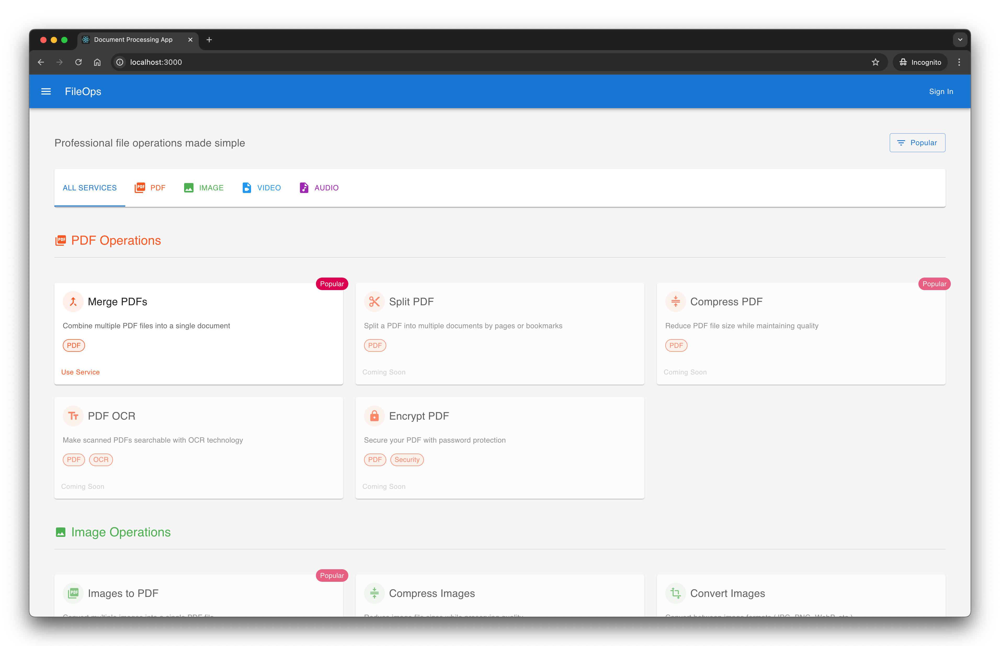

# FileOps - High Performance Document Processing Platform

A cloud-native document processing platform built for speed, scale, and security. Process documents at enterprise scale with minimal operational costs.



## ⚡ Key Features

- **Lightning Fast Processing**
  - Process 1000+ documents concurrently
  - 500ms/page processing speed
  - Real-time progress tracking
  - Parallel processing capabilities

- **Smart Cost Management**
  - Pay-per-use pricing
  - Up to 90% cost savings with spot instances
  - Zero idle costs

- **Enterprise Ready**
  - 99.99% availability
  - Automatic scaling

## 🚄 Processing Pipeline

```mermaid
    A[Client Upload] --> B[API Gateway]
    B --> C[S3 Storage]
    C --> D[Message Queue]
    D --> E[Auto-scaling Workers]
    E --> F[Result Storage]
    F --> G[Client Download]
```

### Burstable Compute Strategy
- **Base Layer**: 2 t3.micro instances ($0.0104/hr)
- **Burst Layer**: Up to 20 c6g.xlarge spot instances
- **Cost Efficiency**: 90% savings vs traditional setup
- **Processing Speed**: 500ms/page with auto-scaling

When a request arrives:
1. Queue depth triggers worker auto-scaling
2. Spot instances spin up in 20-30 seconds
3. Tasks are distributed for parallel processing
4. Workers scale down when queue empties
5. Pay only for actual processing time

## 🏗 Tech Stack

- **Backend**: Python, Flask, Celery
- **Frontend**: React, TypeScript
- **Infrastructure**: Docker, Kubernetes
- **Storage**: S3, PostgreSQL, Redis

## 🛠 Features

- PDF Operations (Merge, Split, Compress)
- Document Format Conversion
- OCR Processing
- Document Encryption
- Real-time Progress Tracking

## 🚀 Quick Start

```bash
# Clone and run
git clone https://github.com/hurryingauto3/fileops.git
cd fileops
docker-compose up -d
```
